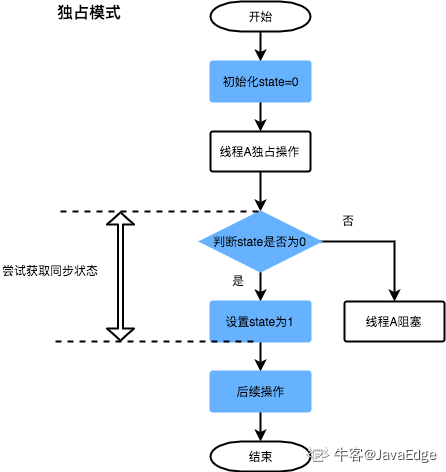
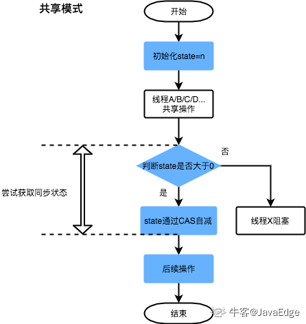
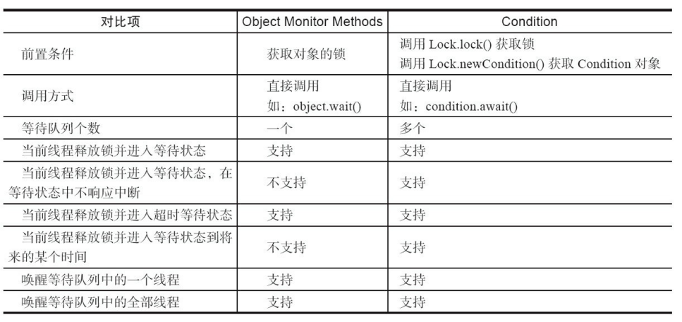
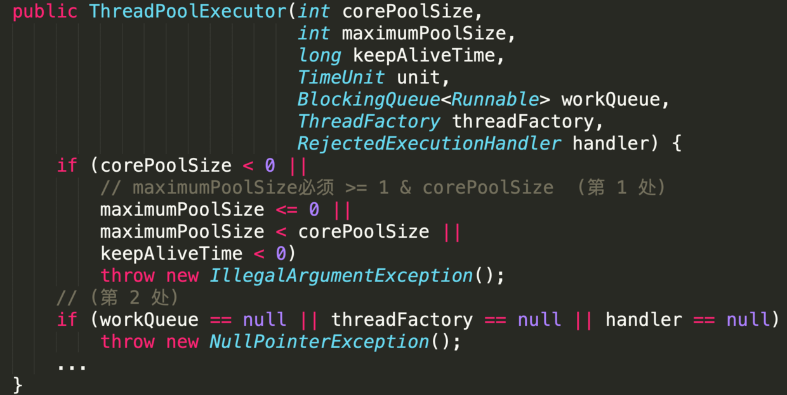
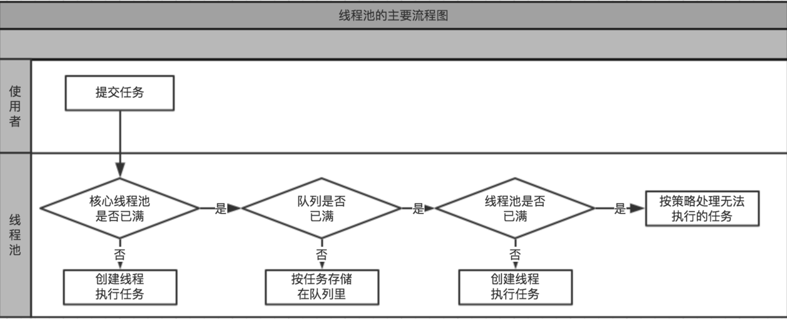
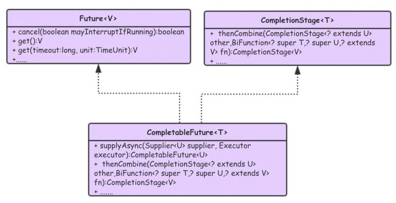

# 1 **ReentTrantLock**

- ReentrantLock主要利用CAS+AQS队列来实现。它支持公平锁和非公平锁，两者的实现类似。

  - CAS：Compare and Swap，比较并交换。CAS有3个操作数：内存值V、预期值A、要修改的新值B。当且仅当预期值A和内存值V相同时，将内存值V修改为B，否则什么都不做。该操作是一个原子操作，被广泛的应用在Java的底层实现中。在Java中，CAS主要是由sun.misc.Unsafe这个类通过JNI调用CPU底层指令实现

  - AQS使用一个FIFO的队列表示排队等待锁的线程，队列头节点称作“哨兵节点”或者“哑节点”，它不与任何线程关联。其他的节点与等待线程关联，每个节点维护一个等待状态waitStatus
  
    
  
    ---
  
    
  
-  ReentrantLock的基本实现可以概括为：先通过CAS尝试获取锁。如果此时已经有线程占据了锁，那就加入AQS队列并且被挂起。当锁被释放之后，排在CLH队列队首的线程会被唤醒，然后CAS再次尝试获取锁。在这个时候，如果：

   非公平锁：如果同时还有另一个线程进来尝试获取，那么有可能会让这个线程抢先获取；
   
   公平锁：如果同时还有另一个线程进来尝试获取，当它发现自己不是在队首的话，就会排到队尾，由队首的线程获取到锁。
   
   ### ReenTrantLock 的种类
   
   ReentrantLock锁有几种：lock、tryLock、tryLock(long timeout, TimeUnit unit)、lockInterruptibly。
   
   lock 阻塞等待获取锁，优先考虑获取锁，待获取锁成功后，才响应中断。
   
   lockInterruptibly 优先考虑响应中断，而不是响应锁的普通获取或重入获取。 
   
   tryLock() 是一个有返回值的方法，试图申请一个锁，在成功获得锁后返回true，否则，立即返回false,而且线程可以立即离开去做其他的事情。
   
   tryLock(long timeout, TimeUnit unit) 是一个具有超时参数的尝试申请锁的方法，阻塞时间不会超过给定的值；如果成功则返回true
   
   ### ReenTrantLock 和 synchronized的区别
   
   - ReenTrantLock可以指定是公平锁还是非公平锁。而synchronized只能是非公平锁
    ```properties
     思考?如何两个线程之间交替打印 26英文字母和阿拉伯数字?
    ```
   
   - ReenTrantLock提供了一个Condition（条件）类，用来实现分组唤醒需要唤醒的线程们，而不是像synchronized要么随机唤醒一个线程要么唤醒全部线程
   
   - ReenTrantLock提供了一种能够中断等待锁的线程的机制，通过lock.lockInterruptibly()来实现这个机制
   
   ##  Condition
   
     - 在使用Lock之前，我们使用的最多的同步方式应该是synchronized关键字来实现同步方式了。配合Object的wait()、notify()系列方法可以实现等待/通知模式。Condition接口也提供了类似Object的监视器方法，与Lock配合可以实现等待/通知模式，但是这两者在使用方式以及功能特性上还是有差别的。
   
       ​																								-摘自《Java并发编程的艺术》
   
       
   


​			  condition可以通俗的理解为条件队列。当一个线程在调用了await方法以后，直到线程等待的某个条件为真的时候才会被唤醒。这种方式为线程提供了更加简单的等待/通知模式。Condition必须要配合锁一起使用，因为对共享状态变量的访问发生在多线程环境下。一个Condition的实例必须与一个Lock绑定，因此Condition一般都是作为Lock的内部实现。


# 2 CountDownLatch 和 CyclicBarrier

- CountDownLatch :   倒数计数器，构造时设定计数值，当计数值归零后，所有阻塞线程恢复执行；其内部实现了AQS框架
  - 初始计数值在构造CountDownLatch对象时传入，每调用一次 countDown() 方法，计数值就会减1。
  - 线程可以调用CountDownLatch的await方法进入阻塞，当计数值降到0时，所有之前调用await阻塞的线程都会释放
  - 注意：CountDownLatch的初始计数值一旦降到0，无法重置。意思是计数器减 1 操作是**一次性**的，也就是说当计数器减到 0， 再有线程调用 await() 方法，该线程会直接通过，**不会再起到等待其他线程执行结果起到同步的作用了**
  
- CyclicBarrier:   循环栅栏，构造时设定等待线程数，当所有线程都到达栅栏后，栅栏放行；其内部通过ReentrantLock和Condition实现同步

  - 在CyclicBarrier类的内部有一个计数器，每个线程在到达屏障点的时候都会调用await方法将自己阻塞，此时计数器会减1，当计数器减为0的时候所有因调用await方法而被阻塞的线程将被唤醒。

    

- 使用场景:
  - **CountDownLatch 主要用来解决一个线程等待多个线程的场景，可以类比旅游团团长要等待所有游客到齐才能去下一个景点**
  - **而 CyclicBarrier 是一组线程之间的相互等待，可以类比几个驴友之间的不离不弃，共同到达某个地方，再继续出发，这样反复**
  
- 两者区别:

  - CountDownLatch 是一次性的，CyclicBarrier 是可循环利用的
  - CountDownLatch 参与的线程的职责是不一样的，有的在倒计时，有的在等待倒计时结束。CyclicBarrier 参与的线程职责是一样的。


# 3 ThreadPoolExecutor 和 CompletableFuture

## 3.1 ThreadPoolExecutor 	

- 第1个参数: corePoolSize 表示常驻核心线程数 

  如果等于0,则任务执行完之后,没有任何请求进入时销毁线程池的线程; 

  如果大于0,即使本地任务执行完毕,核心线程也不会被销毁.

   这个值的设置非常关键; 设置过大会浪费资源; 

  设置过小会导致线程频繁地创建或销毁.

- 第2个参数: maximumPoolSize 表示线程池能够容纳同时执行的最大线程数 

  从第1处来看,必须>=1. 

  如果待执行的线程数大于此值,需要借助第5个参数的帮助,缓存在队列中. 

  如果`maximumPoolSize = corePoolSize`,即是固定大小线程池.

- 第3个参数: keepAliveTime 表示线程池中的线程空闲时间 

  当空闲时间达到`keepAliveTime`时,线程会被销毁,直到只剩下`corePoolSize`个线程; 

  避免浪费内存和句柄资源. 

  在默认情况下,当线程池的线程数大于`corePoolSize`时,`keepAliveTime`才起作用.

   但是当`ThreadPoolExecutor`的`allowCoreThreadTimeOut = true`时,核心线程超时后也会被回收.

- 第4个参数: TimeUnit表示时间单位 

  keepAliveTime的时间单位通常是TimeUnit.SECONDS.

- 第5个参数: workQueue 表示缓存队列 

  当请求的线程数大于`maximumPoolSize`时,线程进入`BlockingQueue`.

- 第6个参数: threadFactory 表示线程工厂 

  它用来生产一组相同任务的线程; 

  线程池的命名是通过给这个factory增加组名前缀来实现的.

  在虚拟机栈分析时,就可以知道线程任务是由哪个线程工厂产生的.

-  第7个参数: handler 表示执行拒绝策略的对象 

  当超过第5个参数`workQueue`的任务缓存区上限的时候,就可以通过该策略处理请求,这是一种简单的限流保护. 友好的拒绝策略可以是如下三种:

   (1 ) 保存到数据库进行削峰填谷;在空闲时再提取出来执行 

   (2)转向某个提示页面

   (3)打印日志

### 3.1.1 创建线程池的几种方式

- ExecutorService newFixedThreadPool(int nThreads)

  - 固定线程池  

    - 特点: `maximumPoolSize = corePoolSize`

    - 适用于任务并发数量可控的,短时间内不会有大量任务提交的场景
- ExecutorService newCachedThreadPool()

  - 缓存线程池  
    - 特点:corePoolSize = 0 ,maximumPoolSize` 最大可以至`Integer.MAX_VALUE,阻塞队列采用同步队列SynchronousQueue,所有任务即时提交线程执行,即不会有任务被阻塞在队列中
    - 该线程池适用于**短时间**内有任务并发,但任务都是在**短时间**内可以处理完毕的
- ExecutorService newSingleThreadExecutor()

  - 单线程池

    - 特点:`maximumPoolSize = corePoolSize = 1`

    - 适用于提交任务按优先级依次执行
- ScheduledExecutorService newScheduledThreadPool(int corePoolSize)
  - 固定调度线程池
    - 适用于延迟执行任务的场景

### 3.1.2 线程池执行流程图



 ```properties
思考?任务执行过程中发生异常会发生什么？
 ```

## 3.2 CompletableFuture



CompletableFuture 实现了 Future 和 CompletionStage 两个接口。实现 Future 接口是为了关注异步任务什么时候结束，和获取异步任务执行的结果。实现 CompletionStage 接口，其提供了非常丰富的功能，实现了串行关系、并行关系、汇聚关系等。可以显式完成的Future（设置其值和状态），并且可以用作CompletionStage，支持在完成时触发依赖函数和操作

 ```properties
为什么引入CompletableFuture？
 ```

- CompletableFuture提供了一种候选方法，与事件处理器不同，CompletableFuture可以组合。利用CompletableFuture，可以指定希望做什么，以及希望以什么顺序执行这些工作。这些动作不会立即发生，不过重要的是将所有代码放在一起。

- CompletableFuture提供了非常强大的 Future 的扩展功能，可以帮助我们简化异步编程的复杂性，并且提供了函数式编程的能力，可以通过回调的方式处理计算结果，也提供了转换和组合 CompletableFuture 的方法。

- CompletableFuture 类声明了 CompletionStage 接口，CompletionStage 接口实际上提供了同步或异步运行计算的舞台，所以我们可以通过实现多个 CompletionStage 命令，并且将这些命令串联在一起的方式实现多个命令之间的触发。

### 3.2.1 CompletableFuture 核心优势

- 无需手工维护线程，给任务分配线程的工作无需开发人员关注；
- 在使用上，语义更加清晰明确；
- 代码更加简练，支持链式调用，让你更专注业务逻辑。
- 方便的处理异常情况

